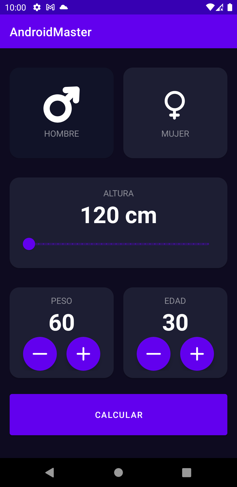
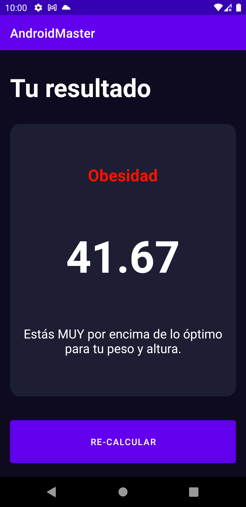
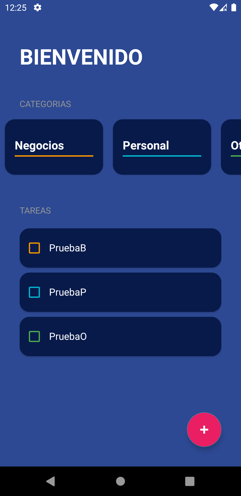
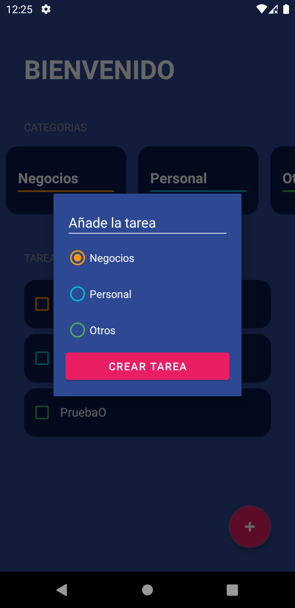
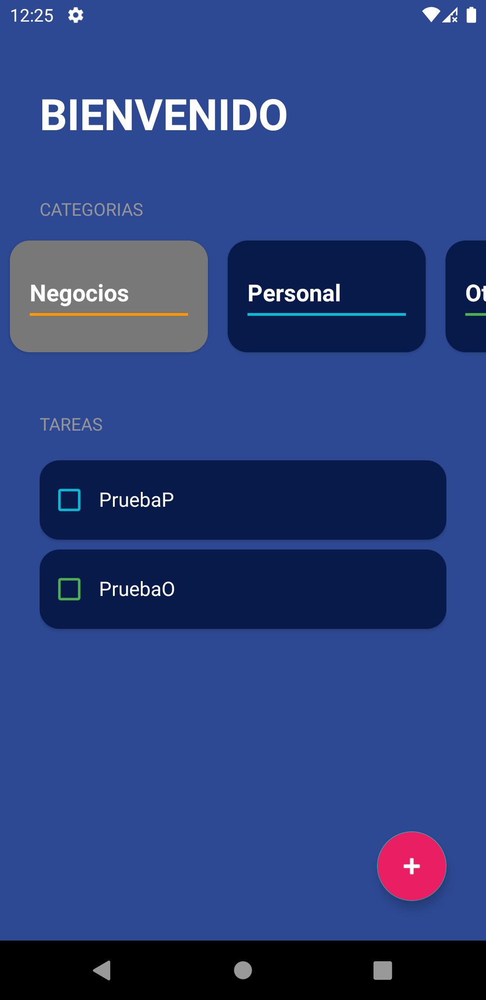
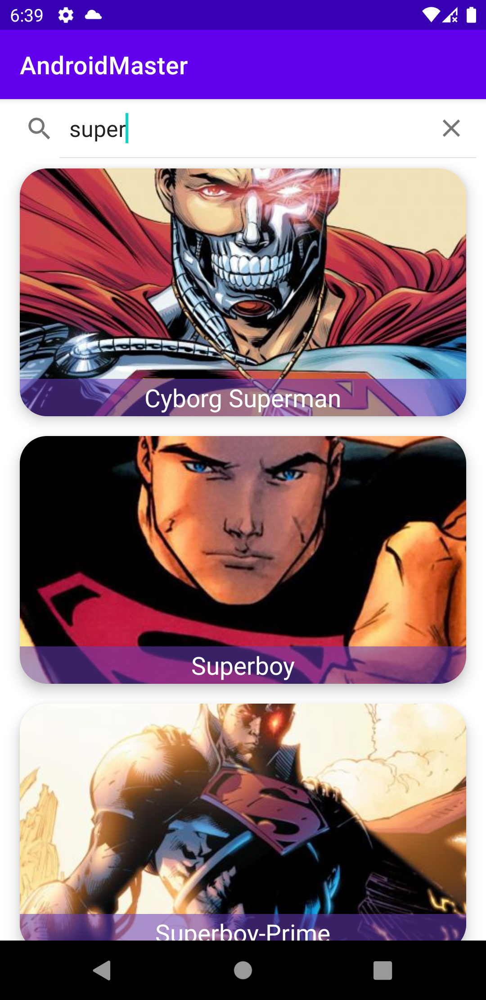
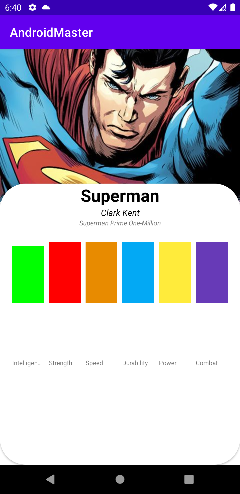
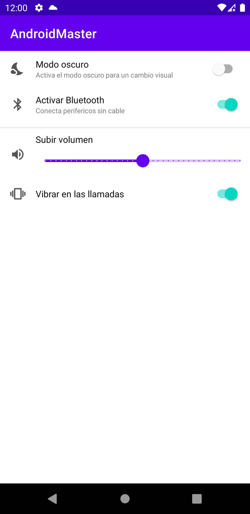
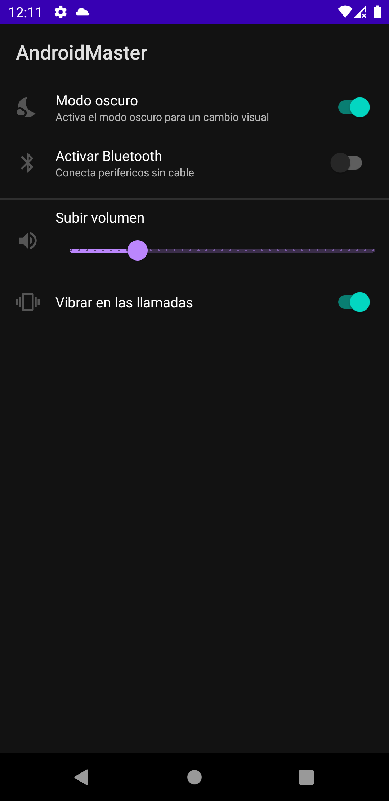

# Android Master

## Temas

- [x]  Variables en Kotlin
- [x]  Funciones en Kotlin
- [x]  Funciones con parámetros en entrada y salida
- [x]  If- else
- [x]  Expresión When
- [x]  Nulabilidad
- [x]  Arrays
- [x]  Listas
- [x]  Navegación entre Pantallas

### Aplicación IMC

|                                                              |                                                                                                                                                        |
|:------------------------------------------------------------------------------:|:------------------------------------------------------------------------------:|
|    |    |

- [x]  Cambios entre pantallas
- [x]  Gestión y creación de Colores
- [x]  Diseño de UI
- [x]  CardView
- [x]  RangeSlider
- [x]  Multiples idiomas
- [x]  Listeners y clicks

### TODO App

|                                                              |                                                                                                                                                        |
|:------------------------------------------------------------------------------:|:------------------------------------------------------------------------------:|
|    |    |
|    |                                                             |

- [x]  RecyclerView
- [x]  Dialog
- [x]  Sealed Class
- [x]  Funciones lambdas

### Buscador de Superhéroes

|                                                              |                                                                                                                                                        |
|:------------------------------------------------------------------------------:|:------------------------------------------------------------------------------:|
|    |    |

- [x]  SearchView
- [x]  Consumo de APIs con Retrofit
- [x]  Funciones lambdas
- [x]  RecyclerView

### Pantalla de ajustes con persistencia de datos

|                                                              |                                                                                                                                                        |
|:------------------------------------------------------------------------------:|:------------------------------------------------------------------------------:|
|    |    |

- [x]  Persistencia de datos con DataStore
- [x]  Switch y RangeSlider
- [x]  Modo oscuro
